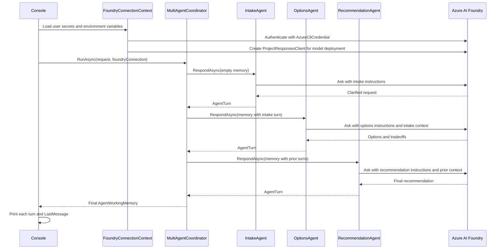

# MultiAgentTeachingDemo

This repository contains a very small C# 10 console application that demonstrates a multi-agent solution in the simplest possible way.

The app calls an Azure AI Foundry model once per agent turn. That means the output can vary from run to run, which is useful for showing a more realistic multi-agent workflow where each agent has its own instructions and contributes live model-generated work.

The app can also connect to an Azure AI Foundry project. It uses Azure CLI authentication, so local development signs in with `az login`. The Foundry project URL and model deployment name are read from .NET user secrets or same-named environment variables, not from source code.

## What This Demo Teaches

A multi-agent solution can be explained as a workflow where several focused agents collaborate on one request. Each agent has a role, reads shared context, adds its own contribution, and passes the updated context forward.

This sample demonstrates four core ideas:

- A user request starts the workflow.
- A coordinator controls the order of agent execution.
- Each agent has one clear responsibility.
- Shared working memory carries context from one agent to the next.

It also demonstrates one practical Azure setup idea:

- Infrastructure configuration, such as a Foundry project URL and model deployment name, should live outside source control.

## Scenario

The demo uses one deliberately simple scenario:

> A software team lead wants to try a one-hour daily pair programming habit, but wants the first experiment to stay lightweight and easy to reverse.

The fictional app is a tiny decision-support assistant for a team lead. The team lead is not asking for a complete engineering transformation plan. They are asking for a practical way to test one new team habit without creating a heavy process, slowing delivery, or forcing everyone into a permanent change before the idea has been tested.

That makes the scenario useful for teaching because the problem is small, realistic, and easy to reason about. It has enough ambiguity to benefit from multiple viewpoints, but it is not so complex that learners need domain expertise before they can understand the code.

The team lead's request contains three different kinds of work:

- Clarify what the person is really asking for.
- Generate a few reasonable ways to approach the experiment.
- Choose one recommendation that respects the original constraint.

Those three kinds of work map directly to the three agents in the sample.

## Why Multiple Agents Make Sense Here

A single method could produce the final answer directly. That would be shorter, but it would hide the multi-agent pattern. This demo intentionally splits the work into three roles so learners can see how collaboration works.

The split is useful because each agent has a narrow responsibility:

- `IntakeAgent` is responsible for understanding the problem. It restates the request, names the constraint, and describes what success should mean.
- `OptionsAgent` is responsible for solution exploration. It proposes multiple lightweight paths instead of jumping straight to a recommendation.
- `RecommendationAgent` is responsible for synthesis. It reads what came before, chooses a path, and turns the workflow into a final answer.

This is the core reason multi-agent designs can be helpful: different agents can focus on different aspects of a problem. In this teaching app, they share one Foundry model deployment, but each agent uses a different instruction block and receives the prior agent turns through shared memory.

## How The Agents Work Together

The agents do not call each other directly. Instead, the `MultiAgentCoordinator` runs them in order and passes shared `AgentWorkingMemory` from one agent to the next.

The flow is:

1. The app creates a `UserRequest` that contains the audience, question, and constraint.
2. The app loads `FoundryConnectionContext` so infrastructure setup is visible to every agent without mixing Azure code into each agent.
3. The coordinator creates the first `AgentWorkingMemory` value.
4. `IntakeAgent` reads the request and adds the first `AgentTurn`.
5. `OptionsAgent` receives memory that already contains the intake turn, then adds possible approaches.
6. `RecommendationAgent` receives memory that includes the earlier turns, then writes the final recommendation.
7. The console app prints every turn so learners can see the collaboration step by step.

The shared memory is the handoff mechanism. It lets each agent build on previous work without depending on the concrete implementation of another agent. That keeps the sample small, but it also mirrors a common production idea: agents should communicate through clear inputs and outputs instead of reaching into each other's internals.

In the running console output, those responsibilities appear as three agent turns:

- `IntakeAgent` clarifies the request and success criteria.
- `OptionsAgent` proposes a few lightweight choices.
- `RecommendationAgent` chooses one path and produces the final recommendation.

That is the entire teaching scenario: understand the problem, design options, and choose a next step.

## Why The App Uses Live Foundry Calls

The first version of this demo was deterministic so the orchestration pattern was easy to see. This version intentionally goes one step further and asks Azure AI Foundry to do the work for each agent.

That makes the sample more realistic. The `IntakeAgent`, `OptionsAgent`, and `RecommendationAgent` each send a role-specific prompt to the configured Foundry model deployment. The response from one agent is stored in `AgentWorkingMemory`, then supplied as context to the next agent.

The tradeoff is that the output is no longer identical on every run, and each run can consume model quota or incur cost in your Azure subscription. The teaching benefit is that learners can see how separate agent responsibilities still matter when a real model is generating each turn.

## Azure AI Foundry Connection

The app uses the Azure AI Projects SDK to create an `AIProjectClient` when a Foundry project URL and model deployment name are configured.

Local authentication uses `AzureCliCredential`, which means the identity comes from the Azure CLI. Sign in before running the connected version:

```powershell
az login
az account show
```

The endpoint format is:

```text
https://<resource-name>.services.ai.azure.com/api/projects/<project-name>
```

You can find this URL in the Microsoft Foundry portal for your project. Look in the project overview or the Libraries/SDK connection details for the Foundry project URL. You can find the model deployment name in the Models and endpoints area for your Foundry project.

### Store Required Values With .NET User Secrets

Use these commands from the repository root:

```powershell
dotnet user-secrets set "AZURE_AI_FOUNDRY_PROJECT_URL" "https://<your-resource>.services.ai.azure.com/api/projects/<your-project>"
dotnet user-secrets set "MODEL_DEPLOYMENT_NAME" "<your-model-deployment-name>"
az login
```

You can confirm the value is stored with:

```powershell
dotnet user-secrets list
```

User secrets are stored in your local user profile, not in this repository. They are appropriate for local development settings such as the Foundry project URL and model deployment name.

### Environment Variable Alternative

The app also supports same-named environment variables.

For the current PowerShell session:

```powershell
$env:AZURE_AI_FOUNDRY_PROJECT_URL = "https://<your-resource>.services.ai.azure.com/api/projects/<your-project>"
$env:MODEL_DEPLOYMENT_NAME = "<your-model-deployment-name>"
```

Use either .NET user secrets or environment variables. Environment variables are loaded after user secrets, so they override user secrets for the current process when both are set.

### What The Connection Does

When the endpoint is configured, the app:

1. Reads `AZURE_AI_FOUNDRY_PROJECT_URL` and `MODEL_DEPLOYMENT_NAME` from user secrets or same-named environment variables.
2. Creates an `AIProjectClient` for that endpoint.
3. Requests a token through `AzureCliCredential`, which uses your `az login` identity.
4. Creates a `ProjectResponsesClient` for the configured model deployment.
5. Calls Foundry once for each agent turn.

The three teaching agents all use the same model deployment, but they do not use the same prompt. Each agent has a different instruction block so its contribution stays focused.

## Project Structure

```text
.
|-- .github/
|   `-- copilot-instructions.md
|-- .gitignore
|-- MultiAgentTeachingDemo.csproj
|-- Program.cs
`-- README.md
```

The main demo is intentionally contained in `Program.cs`. For a larger application, these classes would normally move into separate files and possibly separate projects. Keeping them together makes the teaching flow easier to read from top to bottom.

## Requirements

- .NET SDK 8.0 or later
- Azure CLI, if you want to run the Foundry-connected path
- Access to an Azure AI Foundry project, if you want the Foundry connection to authenticate successfully
- A terminal capable of running `dotnet` commands

The project targets `net8.0` and pins `<LangVersion>10.0</LangVersion>` so the code is built as C# 10.

## Run The Demo

From the repository root, run:

```powershell
dotnet run
```

Expected output will show:

1. The original request.
2. The constraint.
3. The Foundry connection status.
4. Each agent turn.
5. The final recommendation.

## Walkthrough Of A Run

This section explains what is happening on the surface in the console output and what is happening in the background inside the app.

Because the agents call a live Foundry model deployment, your exact wording will vary from run to run. The structure should stay the same: setup, connection, intake, options, recommendation, final answer.

### 1. App Header And User Request

On the surface, the app starts by printing the title and the fixed teaching request:

```text
Multi-agent teaching demo
=========================

User request: How can we try a one-hour daily pair programming habit?
Constraint:   Keep the first experiment lightweight and easy to reverse.
```

In the background, this comes from the `UserRequest` record created at the top of `Program.cs`:

```csharp
UserRequest request = new(
    Audience: "software team lead",
    Question: "How can we try a one-hour daily pair programming habit?",
    Constraint: "Keep the first experiment lightweight and easy to reverse.");
```

This is the original problem that every agent will see. The request has three fields on purpose:

- `Audience` tells the model who the answer is for.
- `Question` is the actual problem to solve.
- `Constraint` is the boundary every agent must respect.

The important teaching point is that the app does not ask three unrelated questions. It starts with one shared request, then asks different agents to look at that request through different lenses.

### 2. Foundry Connection Status

On the surface, the app prints a connection block similar to this:

```text
Foundry connection
------------------
Created AIProjectClient for https://<your-resource>.services.ai.azure.com/api/projects/<your-project> using model deployment '<your-model-deployment-name>'. Azure CLI authentication succeeded with a token that expires at 2026-07-02 06:55:56Z. Live Foundry model calls are enabled for the three teaching agents.
```

In the background, `FoundryConnectionContext.Load()` does the setup work before any agent runs.

It reads these values from .NET user secrets or same-named environment variables:

- `AZURE_AI_FOUNDRY_PROJECT_URL`
- `MODEL_DEPLOYMENT_NAME`

Then it creates the Azure clients:

```csharp
AzureCliCredential credential = new();
AIProjectClient projectClient = new(projectUri, credential);
ProjectResponsesClient responsesClient = projectClient.ProjectOpenAIClient.GetProjectResponsesClientForModel(modelDeploymentName);
```

That small setup block is doing several useful things:

- `AzureCliCredential` means local authentication comes from `az login`.
- `AIProjectClient` connects the app to your Foundry project URL.
- `GetProjectResponsesClientForModel` creates the client used to call your configured model deployment.
- The app requests a token to prove the Azure CLI identity is usable before the agent calls begin.

If setup is incomplete, the app prints the required commands and exits before running the agents. That prevents a confusing partial demo where some output is real and some output is fake.

### 3. The Coordinator Starts The Agent Workflow

On the surface, there is no special console output for the coordinator. You only see the agent turns that come later.

In the background, the coordinator is the object that controls the sequence:

```csharp
MultiAgentCoordinator coordinator = new(new IAgent[]
{
    new IntakeAgent(),
    new OptionsAgent(),
    new RecommendationAgent()
});
```

The coordinator then runs the agents in order:

```csharp
finalMemory = await coordinator.RunAsync(request, foundryConnection);
```

The coordinator does not know how to clarify a request, design options, or make a recommendation. It only knows this process:

1. Start with a request and an empty list of turns.
2. Give the current working memory to the next agent.
3. Wait for that agent to return one `AgentTurn`.
4. Add the turn to working memory.
5. Move to the next agent.

That separation is the core orchestration lesson. The workflow is centralized, but the reasoning is distributed across focused agents.

### 4. Intake Agent: Clarify The Problem

On the surface, the first agent turn looks like this:

```text
[Intake Agent]
Goal: Clarify the request and name the success criteria.
You want guidance on piloting a one-hour daily pair programming habit for a software team, aimed at a team lead. The main constraint is that the first experiment must be lightweight, low-risk, and easy to stop or change if it creates friction. Success should mean the team can try it with minimal process overhead, clearly observe its impact on workflow and collaboration, and decide quickly whether to continue, adjust, or drop it.
```

In the background, `IntakeAgent` builds a role-specific instruction block:

```csharp
string instructions =
    "You are the Intake Agent in a three-agent teaching demo. " +
    "Clarify the user's request, identify the main constraint, and define what success should mean. " +
    "Do not propose solutions yet. Keep the response to 3 or 4 concise sentences.";
```

Then it sends the audience, question, and constraint to Foundry:

```csharp
string input =
    $"Audience: {request.Audience}\n" +
    $"Question: {request.Question}\n" +
    $"Constraint: {request.Constraint}";
```

The intake agent is deliberately not allowed to solve the problem yet. Its job is to frame the work. This matters because poor framing often causes later agents, tools, or people to solve the wrong problem.

After Foundry responds, the coordinator stores the result as an `AgentTurn` in `AgentWorkingMemory`.

### 5. Options Agent: Explore Choices

On the surface, the second agent turn lists several possible approaches:

```text
[Options Agent]
Goal: Create a small set of practical choices.
Here are 3 lightweight, reversible ways to pilot it:

1. Fixed daily pilot for 2 weeks
...

2. Opt-in pairing window
...

3. Trigger-based pairing
...
```

In the background, `OptionsAgent` receives working memory that already contains the intake result. It does not need to call `IntakeAgent` directly. Instead, it asks working memory to summarize prior turns:

```csharp
$"Prior agent turns:\n{memory.DescribePriorTurns()}"
```

That prior context is included in the prompt sent to Foundry. The options agent instruction tells the model what kind of contribution to make:

```csharp
string instructions =
    "You are the Options Agent in a three-agent teaching demo. " +
    "Use the intake agent's clarification to create three practical options. " +
    "For each option, include one short tradeoff. Do not make the final recommendation. " +
    "Keep the response compact and easy to read in a console app.";
```

This is where the multi-agent pattern becomes visible. The second model call is not just a fresh answer to the original user question. It is a new role-specific request that includes the first agent's output.

The options agent also has an explicit boundary: it should not choose the final path. That keeps exploration separate from decision making.

### 6. Recommendation Agent: Choose A Path

On the surface, the third agent chooses one of the options and turns it into a practical recommendation:

```text
[Recommendation Agent]
Goal: Choose one path and describe the next step.
I recommend **Option 2: an opt-in daily pairing window**.

Why this path:
- **Lightweight:** no mandate, no schedule changes beyond reserving a slot.
- **Easy to reverse:** if it creates friction, stop after a week with no process cleanup.
- **Low-risk:** people use it only when it’s helpful.
```

In the background, `RecommendationAgent` receives working memory that now includes both earlier turns:

- The intake framing.
- The options and tradeoffs.

Its instruction block asks Foundry to synthesize rather than brainstorm:

```csharp
string instructions =
    "You are the Recommendation Agent in a three-agent teaching demo. " +
    "Read the prior agent turns, choose one path, and produce the final recommendation. " +
    "Respect the user's constraint that the experiment must stay lightweight and easy to reverse. " +
    "Include a short first step and a short review checkpoint. Keep the response under 180 words.";
```

This final agent is where the workflow turns from analysis into action. It is allowed to choose, but only after seeing the context created by the earlier agents.

### 7. Final Answer

On the surface, the console prints the recommendation a second time under `Final answer`:

```text
Final answer
------------
I recommend **Option 2: an opt-in daily pairing window**.
...
```

In the background, the app is simply printing `finalMemory.LastMessage`:

```csharp
Console.WriteLine(finalMemory.LastMessage);
```

That value is the message from the last agent turn. In this demo, the final agent is the `RecommendationAgent`, so the final answer matches the recommendation turn.

The repeated output is intentional for teaching. It lets learners distinguish between the full agent trace and the final response that an app might show to an end user.

### End-To-End Flow

The whole run can be summarized like this:



### What To Point Out When Teaching

There are a few details worth calling out while walking through the sample:

- The agents share one model deployment, but they do different work because their instructions are different.
- The agents do not call each other. The coordinator moves memory from one agent to the next.
- `AgentWorkingMemory` is the shared context. It contains the original request, Foundry connection context, and every prior turn.
- The model output is not deterministic. A later run might recommend a different option, but it should still follow the same agent workflow.
- The app keeps configuration outside source control. The project URL and deployment name come from user secrets or environment variables.
- The app uses keyless local authentication. `AzureCliCredential` uses the account from `az login`.
- The final output is traceable. You can see which agent contributed which part before the final answer is printed.

This gives you a simple but real teaching example: one user request, three role-specific model calls, shared memory between calls, and a final recommendation produced from the accumulated context.

## Build The Demo

```powershell
dotnet build
```

## How The Code Works

The workflow starts by creating a `UserRequest`:

```csharp
UserRequest request = new(
    Audience: "software team lead",
    Question: "How can we try a one-hour daily pair programming habit?",
    Constraint: "Keep the first experiment lightweight and easy to reverse.");
```

Then the app loads the optional Foundry connection context:

```csharp
FoundryConnectionContext foundryConnection = FoundryConnectionContext.Load();
```

Then the app creates a `MultiAgentCoordinator` with three agents:

```csharp
MultiAgentCoordinator coordinator = new(new IAgent[]
{
    new IntakeAgent(),
    new OptionsAgent(),
    new RecommendationAgent()
});
```

The coordinator calls each agent in order. Each agent receives the current `AgentWorkingMemory`, returns an `AgentTurn`, and the coordinator adds that turn back into memory.

The important teaching idea is that the coordinator does not need to know how each agent thinks. It only knows how to run agents in sequence.

## Key Types

### `UserRequest`

Represents the original request from the user or caller. Real systems might include more metadata, but this demo keeps the request small.

### `AgentTurn`

Represents one agent's contribution to the conversation or workflow.

### `AgentWorkingMemory`

Represents shared state. It contains the original request, the Foundry connection context, and all agent turns produced so far.

### `FoundryConnectionContext`

Represents Azure setup state. It reads `AZURE_AI_FOUNDRY_PROJECT_URL` and `MODEL_DEPLOYMENT_NAME` from .NET user secrets or same-named environment variables, creates an `AIProjectClient`, verifies that Azure CLI authentication can obtain a token, and exposes the `ProjectResponsesClient` used by the agents.

### `IAgent`

Defines the common contract for every agent. Each agent has a name, a goal, and a `Respond` method.

### `MultiAgentCoordinator`

Runs the workflow. It is intentionally simple because orchestration should be easy to see in a teaching demo.

## Teaching Notes

Use this sequence when explaining the code:

1. Start with the user request.
2. Show the Foundry connection status and explain that configuration is separate from agent behavior.
3. Show that the coordinator receives a list of agents.
4. Explain that each agent has a narrow responsibility.
5. Step through the `Run` method.
6. Show how working memory grows after each agent turn.
7. Point out that the final answer is just the last agent's turn.

This helps learners separate three concerns:

- What the user asked for.
- How infrastructure context is loaded.
- Which agents participate.
- How information moves between agents.

## How To Extend The Demo

Good next steps for a lesson are:

- Add a `RiskAgent` that identifies possible downsides.
- Add a `ReviewerAgent` that checks whether the final recommendation respects the original constraint.
- Add a simple unit test project.
- Move each agent into its own file after learners understand the single-file version.
- Give each agent its own model deployment or Foundry agent if you want to teach more advanced routing.

When extending the sample, keep each agent focused on one responsibility. If an agent starts doing several jobs, split it into smaller agents.

## What This Demo Is Not

This project is not a production architecture. It does not include:

- Production authentication strategy
- Authorization design
- Persistence
- Observability
- Retries
- Distributed execution
- Model selection
- Prompt management
- Tool calling
- Human approval workflows

Those topics are important, but they belong after the learner understands the basic collaboration pattern.

## Troubleshooting

If `dotnet run` fails, check the installed SDKs:

```powershell
dotnet --list-sdks
```

If no SDK is installed, install the .NET SDK and retry the build.

If the Foundry connection reports that setup is incomplete, set the required values with:

```powershell
dotnet user-secrets set "AZURE_AI_FOUNDRY_PROJECT_URL" "https://<your-resource>.services.ai.azure.com/api/projects/<your-project>"
dotnet user-secrets set "MODEL_DEPLOYMENT_NAME" "<your-model-deployment-name>"
az login
```

If the Foundry connection reports an Azure CLI authentication failure, run:

```powershell
az login
az account show
```

Also confirm that your signed-in identity has access to the Foundry project.

If the project builds but the output differs from the README, inspect `Program.cs` to see whether the scenario or agent messages were changed.